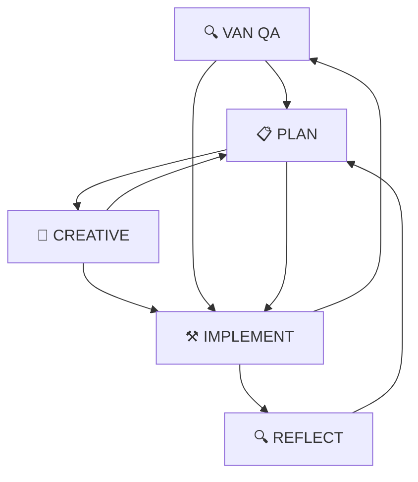

# 🎯 Cursor 五種模式使用指南

## 📋 模式概覽

本專案使用五種開發模式，每種模式都有特定的用途和工作流程：

| 模式 | 圖示 | 快捷鍵 | 主要用途 |
|------|------|--------|----------|
| **VAN** | 🔍 | `Ctrl+Shift+V` | 技術驗證與上下文分析 |
| **PLAN** | 📋 | `Ctrl+Shift+P` | 規劃與策略制定 |
| **CREATIVE** | 🎨 | `Ctrl+Shift+C` | 創意設計與架構決策 |
| **IMPLEMENT** | ⚒️ | `Ctrl+Shift+I` | 程式碼實作與同步 |
| **REFLECT** | 🔍 | `Ctrl+Shift+R` | 回顧與優化 |

## 🔄 模式切換流程

## 🎯 各模式詳細說明

### 🔍 VAN QA 模式
**用途**: 技術驗證與上下文分析
- 執行完整的技術驗證
- 檢查環境、依賴、建置狀態
- 分析專案上下文
- 重建 Memory Bank 文件

**何時使用**:
- 專案初始化時
- 遇到技術問題時
- 需要重新分析上下文時
- 切換專案時

**快捷鍵**: `Ctrl+Shift+V`

### 📋 PLAN 模式
**用途**: 規劃與策略制定
- 與使用者共同定義計劃
- 收集必要資訊
- 制定詳細實作策略
- **不進行程式碼更動**

**何時使用**:
- 開始新功能開發
- 需要制定詳細計劃
- 複雜問題分析
- 架構決策前

**快捷鍵**: `Ctrl+Shift+P`

### 🎨 CREATIVE 模式
**用途**: 創意設計與架構決策
- 系統架構設計
- 技術選型決策
- 創意解決方案制定
- 設計階段決策

**何時使用**:
- 需要創意解決方案
- 架構設計階段
- 技術選型決策
- 複雜問題設計

**快捷鍵**: `Ctrl+Shift+C`

### ⚒️ IMPLEMENT 模式
**用途**: 程式碼實作與同步
- 根據已批准計劃實作
- 同步更新規劃文件
- 確保規劃與專案吻合
- 實際程式碼更動

**何時使用**:
- 計劃已批准後
- 需要實作功能
- 程式碼修改
- 功能開發

**快捷鍵**: `Ctrl+Shift+I`

### 🔍 REFLECT 模式
**用途**: 回顧與優化
- 回顧已完成工作
- 分析問題與改進點
- 制定優化策略
- 積累經驗教訓

**何時使用**:
- 功能完成後
- 遇到問題時
- 需要優化時
- 學習總結時

**快捷鍵**: `Ctrl+Shift+R`

## 🚀 快速操作

### 常用快捷鍵
- `Ctrl+Shift+M`: 更新 Memory Bank
- `Ctrl+Shift+Q`: 執行 VAN QA
- `Ctrl+Shift+S`: 儲存上下文

### 模式切換命令
- 直接輸入模式名稱: `VAN`, `PLAN`, `CREATIVE`, `IMPLEMENT`, `REFLECT`
- 使用快捷鍵切換
- 在對話中明確指定模式

## 📊 模式狀態指示

每個回應開頭會顯示當前模式：
- `# Mode: VAN` - 技術驗證模式
- `# Mode: PLAN` - 規劃模式
- `# Mode: CREATIVE` - 創意模式
- `# Mode: IMPLEMENT` - 實作模式
- `# Mode: REFLECT` - 回顧模式

## 🔧 設定檔位置

模式配置位於: `.cursor/settings.json`

## 📝 最佳實踐

1. **從 PLAN 開始**: 新任務建議從 PLAN 模式開始
2. **模式順序**: VAN → PLAN → CREATIVE → IMPLEMENT → REFLECT
3. **狀態同步**: 每次模式切換都會同步 Memory Bank
4. **文件更新**: IMPLEMENT 模式會自動更新相關文件
5. **品質檢查**: VAN 模式用於技術驗證

## ⚠️ 注意事項

- PLAN 模式不會進行程式碼更動
- IMPLEMENT 模式需要先有批准的計劃
- 模式切換會自動儲存狀態
- 所有模式都會同步 Memory Bank 
