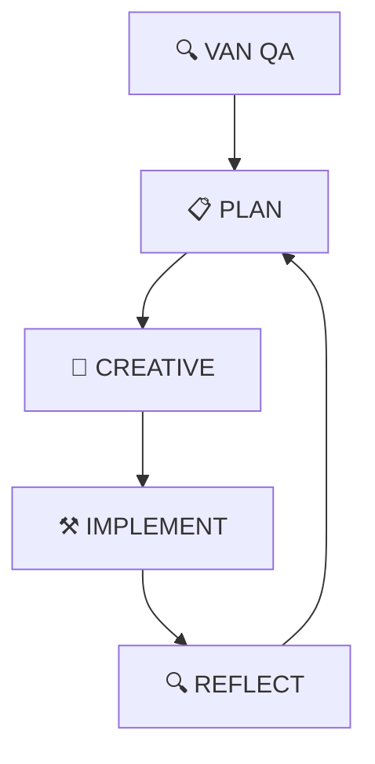

# 🎯 Cursor 配置目錄

本目錄包含 Cursor 編輯器的所有配置檔案，提供統一的開發環境設定。

## 📁 目錄結構

```
.cursor/
├── settings.json          # 主要設定檔（五種模式配置）
├── mcp.json              # MCP 服務配置
├── rules/                # 規則檔案目錄
├── MODE_GUIDE.md         # 模式使用指南
└── README.md             # 本檔案
```

## 🎯 五種開發模式

本專案使用五種開發模式，每種模式都有特定的用途：

| 模式 | 圖示 | 用途 |
|------|------|------|
| **VAN** | 🔍 | 技術驗證與上下文分析 |
| **PLAN** | 📋 | 規劃與策略制定 |
| **CREATIVE** | 🎨 | 創意設計與架構決策 |
| **IMPLEMENT** | ⚒️ | 程式碼實作與同步 |
| **REFLECT** | 🔍 | 回顧與優化 |

## 🚀 快速開始

### 1. 模式切換
使用快捷鍵或直接輸入模式名稱：
- `Ctrl+Shift+V`: VAN QA 模式
- `Ctrl+Shift+P`: PLAN 模式
- `Ctrl+Shift+C`: CREATIVE 模式
- `Ctrl+Shift+I`: IMPLEMENT 模式
- `Ctrl+Shift+R`: REFLECT 模式

### 2. 常用操作
- `Ctrl+Shift+M`: 更新 Memory Bank
- `Ctrl+Shift+Q`: 執行 VAN QA
- `Ctrl+Shift+S`: 儲存上下文

## 📋 設定檔說明

### settings.json
主要設定檔，包含：
- 五種模式的詳細配置
- 模式切換規則
- Memory Bank 設定
- Redis 快取配置
- Context7 整合設定
- 工作流程配置
- 通知設定
- 快捷鍵配置
- Git 整合設定
- 品質控制設定
- 文件自動生成設定

### mcp.json
MCP (Model Context Protocol) 服務配置：
- Angular CLI 整合
- Context7 知識庫查詢
- 檔案系統操作
- 記憶管理
- Redis 向量資料庫
- Memory Bank 管理

## 🔧 自訂設定

### 修改模式配置
編輯 `.cursor/settings.json` 檔案：

```json
{
  "cursor.customModes": {
    "VAN": {
      "name": "VAN QA",
      "description": "技術驗證與上下文分析模式",
      "shortcuts": ["Ctrl+Shift+V", "Cmd+Shift+V"]
    }
  }
}
```

### 新增自訂快捷鍵
在 `cursor.keybindings` 區段新增：

```json
{
  "cursor.keybindings": {
    "customActions": {
      "myAction": "ctrl+shift+a"
    }
  }
}
```

## 📊 模式工作流程



## 🔄 整合功能

### Memory Bank 自動同步
- 每次模式切換自動同步
- 自動備份重要文件
- 跨專案知識共享

### Redis 向量快取
- 高品質知識自動快取
- 向量搜尋支援
- 定期清理過期資料

### Context7 知識庫
- 官方文件查詢
- 程式碼範例獲取
- 自動知識積累

## 📝 開發者指南

### 新開發者設定
1. 複製 `.cursor` 目錄到專案根目錄
2. 安裝必要的 MCP 服務
3. 設定 Redis 連接（可選）
4. 閱讀 `MODE_GUIDE.md`

### 團隊協作
- 所有設定檔版本控制
- 統一的開發環境
- 共享的知識庫
- 標準化的工作流程

## ⚠️ 注意事項

- 設定檔變更需要重啟 Cursor
- 確保 MCP 服務正常運行
- 定期備份 Memory Bank 文件
- 遵循模式切換規則

## 📞 支援

如有問題，請參考：
- `MODE_GUIDE.md`: 詳細的模式使用指南
- `settings.json`: 完整設定說明
- 專案文件: 技術細節和最佳實踐 
