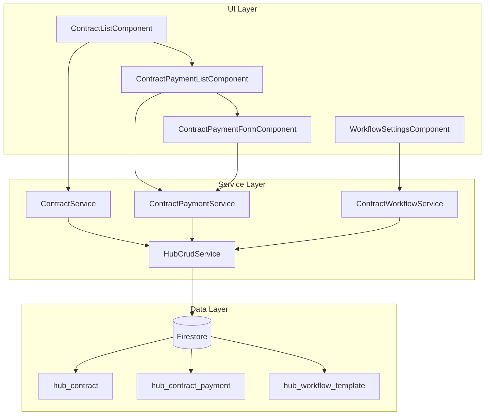
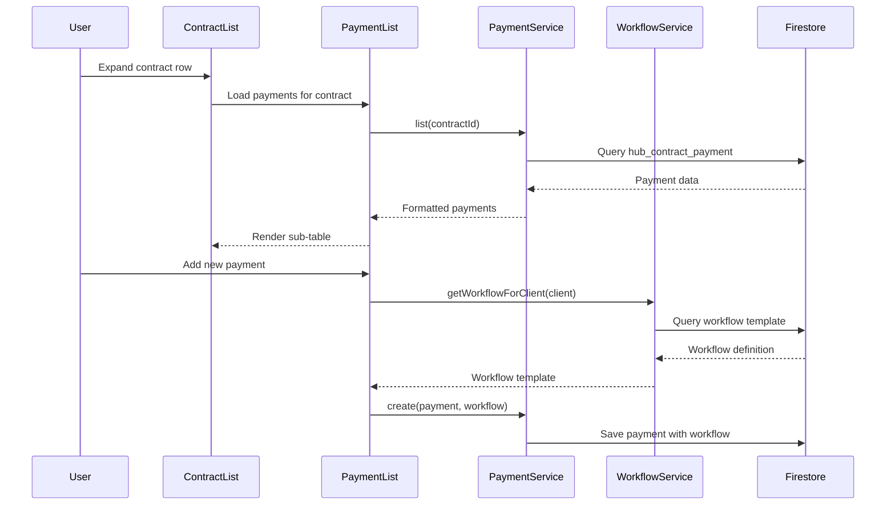
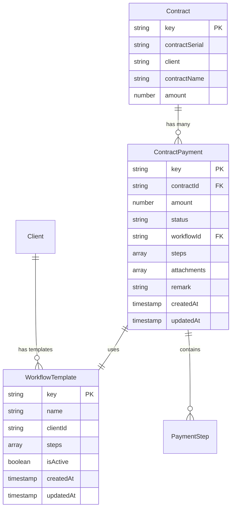

# Design Document

## Overview

The Contract Payments feature extends the existing contract management system to support multiple payment requests per contract with dynamic approval workflows. The design maintains the current architecture patterns while adding new data models, services, and UI components for payment management.

The solution integrates seamlessly with the existing contract list by adding expandable sub-tables that show payment requests. Each payment follows a configurable workflow based on the contract's client, ensuring consistent approval processes.

## Architecture

### High-Level Architecture



### Data Flow Architecture



## Components and Interfaces

### Data Models

#### ContractPayment Interface
```typescript
export interface ContractPayment {
  key?: string;
  contractId: string;
  amount: number;
  status: PaymentStatus;
  workflowId: string;
  steps: ContractPaymentStep[];
  attachments: string[];
  remark: string;
  createdAt: Timestamp;
  updatedAt: Timestamp;
}

export type PaymentStatus = 
  | 'draft' 
  | 'submitted' 
  | 'reviewing' 
  | 'approved' 
  | 'rejected' 
  | 'invoiced' 
  | 'countdown';
```

#### ContractPaymentStep Interface
```typescript
export interface ContractPaymentStep {
  name: string;
  status: StepStatus;
  approver: string;
  comment: string;
  updatedAt: Timestamp;
}

export type StepStatus = 'pending' | 'done' | 'rejected' | 'waiting';
```

#### WorkflowDefinition Interface
```typescript
export interface WorkflowDefinition {
  key?: string;
  name: string;
  clientId: string;
  steps: WorkflowStep[];
  isActive: boolean;
  createdAt: Timestamp;
  updatedAt: Timestamp;
}

export interface WorkflowStep {
  name: string;
  approver: string;
  order: number;
  conditions?: WorkflowCondition[];
}

export interface WorkflowCondition {
  field: string;
  operator: 'gt' | 'lt' | 'eq' | 'gte' | 'lte';
  value: any;
}
```

### Service Layer Design

#### ContractPaymentService
```typescript
@Injectable({ providedIn: 'root' })
export class ContractPaymentService {
  constructor(
    private hubCrud: HubCrudService,
    private workflowService: ContractWorkflowService
  ) {}

  // Core CRUD operations
  list(contractId: string): Observable<ContractPayment[]>
  add(contractId: string, payment: Omit<ContractPayment, 'key' | 'contractId'>): Promise<string>
  update(id: string, payment: Partial<ContractPayment>): Promise<void>
  delete(id: string): Promise<void>

  // Workflow operations
  initializeWorkflow(payment: ContractPayment, workflowId: string): Promise<void>
  advanceWorkflow(paymentId: string, stepIndex: number, approved: boolean, comment?: string): Promise<void>
  getWorkflowStatus(paymentId: string): Promise<WorkflowStatus>

  // Validation
  validatePayment(payment: ContractPayment): ValidationResult
  canEditPayment(payment: ContractPayment): boolean
}
```

#### ContractWorkflowService
```typescript
@Injectable({ providedIn: 'root' })
export class ContractWorkflowService {
  constructor(private hubCrud: HubCrudService) {}

  // Template management
  listTemplates(): Observable<WorkflowDefinition[]>
  getTemplateForClient(clientId: string): Promise<WorkflowDefinition | null>
  createTemplate(template: Omit<WorkflowDefinition, 'key'>): Promise<string>
  updateTemplate(id: string, template: Partial<WorkflowDefinition>): Promise<void>
  deleteTemplate(id: string): Promise<void>

  // Workflow execution
  createWorkflowInstance(templateId: string, paymentId: string): Promise<ContractPaymentStep[]>
  evaluateConditions(step: WorkflowStep, payment: ContractPayment): boolean
  getNextStep(currentStepIndex: number, steps: ContractPaymentStep[]): number | null
}
```

### UI Component Design

#### ContractPaymentListComponent
```typescript
@Component({
  selector: 'contract-payment-list',
  standalone: true,
  changeDetection: ChangeDetectionStrategy.OnPush
})
export class ContractPaymentListComponent implements OnInit {
  @Input() contractId!: string;
  @Input() client!: string;
  
  payments = signal<ContractPayment[]>([]);
  editingPaymentId = signal<string | null>(null);
  loading = signal(false);

  constructor(
    private paymentService: ContractPaymentService,
    private cdr: ChangeDetectorRef
  ) {}

  // Core operations
  loadPayments(): void
  addPayment(): Promise<void>
  editPayment(paymentId: string): void
  savePayment(payment: ContractPayment): Promise<void>
  deletePayment(paymentId: string): Promise<void>
  
  // UI helpers
  getStatusColor(status: PaymentStatus): string
  canEdit(payment: ContractPayment): boolean
  formatAmount(amount: number): string
}
```

#### ContractPaymentFormComponent
```typescript
@Component({
  selector: 'contract-payment-form',
  standalone: true,
  changeDetection: ChangeDetectionStrategy.OnPush
})
export class ContractPaymentFormComponent implements OnInit {
  @Input() payment!: ContractPayment;
  @Input() mode: 'create' | 'edit' = 'create';
  @Output() save = new EventEmitter<ContractPayment>();
  @Output() cancel = new EventEmitter<void>();

  form!: FormGroup;
  attachments = signal<File[]>([]);

  constructor(private fb: FormBuilder) {}

  // Form operations
  buildForm(): void
  validateForm(): boolean
  onSubmit(): void
  onCancel(): void
  
  // File handling
  onFileSelect(files: FileList): void
  removeAttachment(index: number): void
  uploadAttachments(): Promise<string[]>
}
```

## Data Models

### Firestore Collections

#### hub_contract_payment Collection
```typescript
// Document structure
{
  contractId: string,           // Reference to parent contract
  amount: number,              // Payment amount
  status: PaymentStatus,       // Current workflow status
  workflowId: string,          // Reference to workflow template
  steps: ContractPaymentStep[], // Current workflow state
  attachments: string[],       // File URLs
  remark: string,              // User notes
  createdAt: Timestamp,
  updatedAt: Timestamp
}
```

#### hub_workflow_template Collection
```typescript
// Document structure
{
  name: string,                // Template name
  clientId: string,            // Associated client
  steps: WorkflowStep[],       // Workflow definition
  isActive: boolean,           // Template status
  createdAt: Timestamp,
  updatedAt: Timestamp
}
```

### Data Relationships



## Error Handling

### Validation Strategy
- **Client-side validation**: Form validation using Angular Reactive Forms with custom validators
- **Service-level validation**: Business rule validation in ContractPaymentService
- **Database constraints**: Firestore security rules for data integrity

### Error Types and Handling
```typescript
export interface ValidationResult {
  isValid: boolean;
  errors: ValidationError[];
}

export interface ValidationError {
  field: string;
  message: string;
  code: string;
}

// Error handling in service
async add(contractId: string, payment: ContractPayment): Promise<string> {
  try {
    const validation = this.validatePayment(payment);
    if (!validation.isValid) {
      throw new ValidationError(validation.errors);
    }
    
    return await this.hubCrud.add('hub_contract_payment', payment);
  } catch (error) {
    this.handleError(error);
    throw error;
  }
}
```

### Workflow State Management
- **State consistency**: Atomic updates using Firestore transactions
- **Rollback capability**: Transaction-based operations for workflow state changes
- **Conflict resolution**: Optimistic locking for concurrent edits

## Testing Strategy

### Unit Testing
- **Service testing**: Mock HubCrudService for isolated service testing
- **Component testing**: Angular Testing Library for component behavior
- **Model testing**: Validation logic and data transformation testing

### Integration Testing
- **Service integration**: Test service interactions with Firestore
- **Component integration**: Test parent-child component communication
- **Workflow testing**: End-to-end workflow state transitions

### Test Structure
```typescript
describe('ContractPaymentService', () => {
  let service: ContractPaymentService;
  let mockHubCrud: jasmine.SpyObj<HubCrudService>;
  let mockWorkflowService: jasmine.SpyObj<ContractWorkflowService>;

  beforeEach(() => {
    const hubCrudSpy = jasmine.createSpyObj('HubCrudService', ['add', 'update', 'delete', 'useCollection']);
    const workflowSpy = jasmine.createSpyObj('ContractWorkflowService', ['getTemplateForClient', 'createWorkflowInstance']);

    TestBed.configureTestingModule({
      providers: [
        ContractPaymentService,
        { provide: HubCrudService, useValue: hubCrudSpy },
        { provide: ContractWorkflowService, useValue: workflowSpy }
      ]
    });

    service = TestBed.inject(ContractPaymentService);
    mockHubCrud = TestBed.inject(HubCrudService) as jasmine.SpyObj<HubCrudService>;
    mockWorkflowService = TestBed.inject(ContractWorkflowService) as jasmine.SpyObj<ContractWorkflowService>;
  });

  describe('Payment CRUD operations', () => {
    it('should create payment with workflow initialization', async () => {
      // Test implementation
    });
  });

  describe('Workflow management', () => {
    it('should advance workflow to next step when approved', async () => {
      // Test implementation
    });
  });
});
```

### E2E Testing Scenarios
1. **Complete payment workflow**: Create payment → Submit → Approve → Complete
2. **Payment rejection flow**: Create payment → Submit → Reject → Modify → Resubmit
3. **Multi-step approval**: Complex workflow with multiple approval steps
4. **Concurrent editing**: Multiple users editing different payments simultaneously