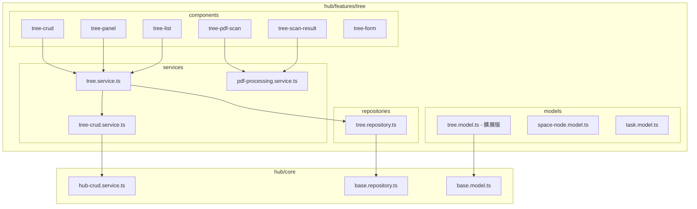
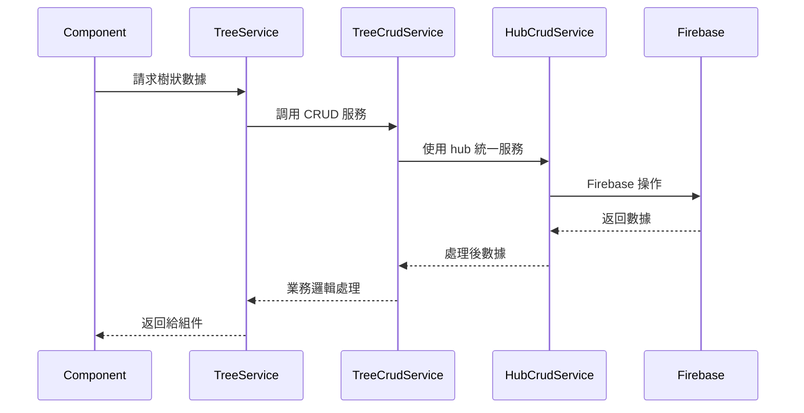

# Design Document

## Overview

本設計文件描述如何將原始 `routes/tree` 模組的完整功能遷移到 `hub/features/tree` 架構中，使其成為 hub 生態系統的自然擴展。

**遷移目標：**
- 將 `routes/tree` 的所有組件和服務遷移到 `hub/features/tree`
- 保持功能完整性，確保所有原有功能都能正常運作
- 遵循 hub 架構模式，使用統一的服務和模型結構
- 整合到現有的 hub 路由和導航系統中

## Architecture

### 目標架構



## Components Migration Plan

### 1. Firebase CRUD Component → Tree CRUD Component
**原始位置：** `routes/tree/firebase-crud/firebase-crud.component.ts`
**目標位置：** `hub/features/tree/components/tree-crud/tree-crud.component.ts`

**遷移策略：**
- 保持原有的模態框操作邏輯
- 將 Firebase 直接操作改為使用 hub-crud.service
- 整合到 hub 的統一錯誤處理機制
- 使用 hub 的統一樣式和主題

### 2. Tree Panel Component → Enhanced Tree Panel
**原始位置：** `routes/tree/panel/panel.component.*`
**目標位置：** `hub/features/tree/components/tree-panel/tree-panel.component.*`

**遷移策略：**
- 保持完整的拖拽、搜尋、右鍵選單功能
- 保持分割面板佈局
- 整合任務管理功能
- 使用 hub 的響應式設計模式

### 3. PDF Scan Component → Tree PDF Scan
**原始位置：** `routes/tree/pdf-scan/pdf-scan.component.*`
**目標位置：** `hub/features/tree/components/tree-pdf-scan/tree-pdf-scan.component.*`

**遷移策略：**
- 保持 Google Cloud Vision API 整合
- 保持頁面選擇和裁切功能
- 整合到 hub 的文件管理系統
- 使用 hub 的統一上傳組件樣式

### 4. Scan Result Component → Tree Scan Result
**原始位置：** `routes/tree/scan-result/scan-result.component.*`
**目標位置：** `hub/features/tree/components/tree-scan-result/tree-scan-result.component.*`

**遷移策略：**
- 保持文件列表和管理功能
- 保持預覽和下載功能
- 整合到 hub 的統一列表組件樣式
- 使用 hub 的統一操作按鈕

### 5. Tree List Component → Enhanced Tree List
**原始位置：** `routes/tree/list/list.component.ts`
**目標位置：** `hub/features/tree/components/tree-list/tree-list.component.ts`

**遷移策略：**
- 擴展現有的基礎列表功能
- 添加更多過濾和排序選項
- 整合到 hub 的統一表格組件
- 使用 hub 的統一分頁機制

## Services Migration Plan

### 1. Firebase CRUD Service → Tree CRUD Service
**原始位置：** `routes/tree/firebase-crud/firebase-crud.service.ts`
**目標位置：** `hub/features/tree/services/tree-crud.service.ts`

**遷移策略：**
- 保持所有 CRUD 操作方法
- 將直接 Firebase 調用改為使用 hub-crud.service
- 添加批量操作支援
- 整合錯誤處理和日誌記錄

### 2. Enhanced Tree Service
**目標位置：** `hub/features/tree/services/tree.service.ts` (擴展現有)

**擴展策略：**
- 保持現有的基礎功能
- 添加高級樹狀操作（移動、複製、搜尋）
- 整合任務管理功能
- 添加統計和分析功能

### 3. PDF Processing Service
**目標位置：** `hub/features/tree/services/pdf-processing.service.ts` (新建)

**實現策略：**
- 封裝 Google Cloud Vision API 調用
- 提供 PDF 裁切和處理功能
- 整合 Firebase Storage 操作
- 提供統一的錯誤處理

## Models Migration Plan

### 1. Complete Data Models
**原始位置：** `routes/tree/models/models.ts`
**目標位置：** `hub/features/tree/models/` (多個文件)

**遷移策略：**
- 將龐大的 models.ts 拆分為多個專門的模型文件
- 保持所有原有的介面定義
- 整合到 hub 的 BaseModel 和 AuditableModel
- 確保類型安全和相容性

**文件結構：**
```
hub/features/tree/models/
├── index.ts                 # 統一匯出
├── space-node.model.ts      # SpaceNode 相關類型
├── task.model.ts           # LeafTask 相關類型
├── tree-operation.model.ts # 操作記錄類型
└── tree.model.ts          # 擴展現有的 TreeNode
```

## Routes Integration

### 路由整合策略
**目標：** 將所有原始路由整合到 hub 系統中

**現有 hub 路由：**
```typescript
// hub/features/tree/routes.ts
export const treeRoutes: Routes = [
  { path: 'list', component: TreeListComponent },
  { path: 'panel', component: TreePanelComponent },
  { path: 'create', component: TreeFormComponent },
  { path: 'edit/:id', component: TreeFormComponent },
  { path: 'pdf-scan', component: TreePdfScanComponent },
  { path: 'scan-result', component: TreeScanResultComponent }
];
```

**需要添加的路由：**
```typescript
// 新增到現有路由中
{ path: 'crud', component: TreeCrudComponent },        // 新增
{ path: 'document-viewer', component: DocumentViewerComponent }, // 新增
```

## Data Flow Design

### 統一數據流


## Integration Points

### 1. 與現有 Hub 功能整合
- **導航整合：** 添加到 hub 主導航選單
- **權限整合：** 使用 hub 的統一權限系統
- **主題整合：** 使用 hub 的統一主題和樣式
- **錯誤處理：** 使用 hub 的統一錯誤處理機制

### 2. 與其他 Hub Features 整合
- **Workspace 整合：** 樹狀結構可以關聯到工作空間
- **Settings 整合：** 樹狀結構配置可以保存到設定中
- **Contracts 整合：** 樹狀結構可以用於合約分類

### 3. 共享組件和服務
- **使用 hub/shared 組件：** 統一的按鈕、表單、列表組件
- **使用 hub/core 服務：** 統一的 CRUD、錯誤處理、日誌服務

## Migration Strategy

### 階段性遷移
1. **階段 1：** 數據模型和基礎服務遷移
2. **階段 2：** 核心組件遷移（CRUD、Panel）
3. **階段 3：** PDF 功能遷移
4. **階段 4：** 路由整合和測試
5. **階段 5：** 向後相容性和清理

### 相容性保證
- 原始 `routes/tree` 路由保持可用
- 數據結構保持相容
- API 介面保持一致
- 逐步遷移用戶到新系統

## Quality Assurance

### 功能完整性檢查
- [ ] 所有原始組件功能都已遷移
- [ ] 所有原始服務方法都已實現
- [ ] 所有原始路由都已整合
- [ ] 所有原始數據模型都已保留

### Hub 整合檢查
- [ ] 使用 hub 統一的服務架構
- [ ] 遵循 hub 的命名規範
- [ ] 整合到 hub 的導航系統
- [ ] 使用 hub 的統一樣式

### 效能和穩定性
- [ ] 大型樹狀結構載入效能
- [ ] PDF 處理效能和穩定性
- [ ] 記憶體使用優化
- [ ] 錯誤處理完整性