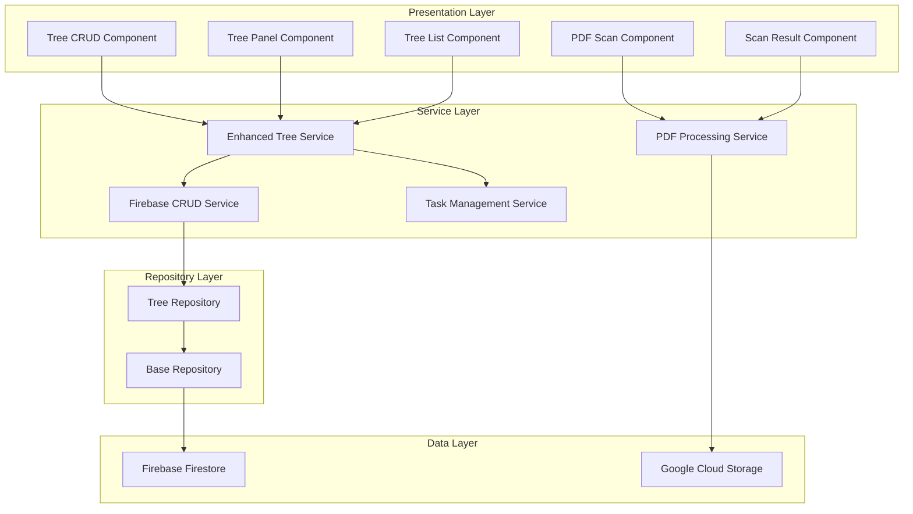
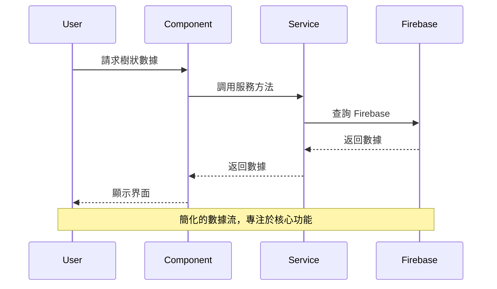

# Design Document

## Overview

本設計文件描述如何將原始 `routes/tree` 模組的完整功能遷移到新的 `hub/features/tree` 架構中。設計採用分層架構，使用 Firebase 作為數據持久化層，確保功能完整性和良好的用戶體驗。

遷移策略採用漸進式方法，保持向後相容性的同時，逐步增強 hub 版本的功能。整個設計遵循 Angular 最佳實踐和 ng-zorro-antd 設計規範。

## Architecture

### 整體架構圖



### 數據流架構



## Components and Interfaces

### 核心組件架構

#### 1. Tree CRUD Component
```typescript
interface TreeCrudComponent {
  // 模態框管理
  showAddModal(parentKey?: string): void;
  showEditModal(node: SpaceNode): void;
  showDeleteConfirm(node: SpaceNode): void;
  
  // 表單操作
  handleSubmit(formData: SpaceNodeForm): Promise<void>;
  handleCancel(): void;
  
  // 驗證邏輯
  validateForm(data: SpaceNodeForm): ValidationResult;
  
  // 事件發射
  nodeCreated: EventEmitter<SpaceNode>;
  nodeUpdated: EventEmitter<SpaceNode>;
  nodeDeleted: EventEmitter<string>;
}
```

#### 2. Enhanced Tree Panel Component
```typescript
interface EnhancedTreePanelComponent {
  // 樹狀操作
  onNodeSelect(event: NzFormatEmitEvent): void;
  onNodeExpand(event: NzFormatEmitEvent): void;
  onNodeDrop(event: NzFormatEmitEvent): void;
  
  // 搜尋和過濾
  onSearchChange(keyword: string): void;
  filterTree(nodes: NzTreeNodeOptions[], keyword: string): NzTreeNodeOptions[];
  
  // 上下文選單
  showContextMenu(event: MouseEvent, node: NzTreeNode): void;
  handleContextAction(action: string, node: NzTreeNode): void;
  
  // 面板管理
  onPanelResize(sizes: number[]): void;
  togglePanel(panel: 'left' | 'right'): void;
  
  // 任務整合
  loadNodeTasks(nodeId: string): void;
  onTaskStatusChange(task: LeafTask): void;
}
```

#### 3. PDF Processing Components
```typescript
interface PdfScanComponent {
  // 文件處理
  beforeUpload(file: NzUploadFile): boolean;
  loadPdfDocument(): Promise<void>;
  extractSelectedPages(): Promise<void>;
  
  // 頁面管理
  selectPageRange(start: number, end: number): void;
  selectAllPages(): void;
  isValidPageRange(): boolean;
  
  // 結果處理
  downloadText(): void;
  saveToStorage(): Promise<void>;
  reset(): void;
}

interface ScanResultComponent {
  // 結果管理
  loadScanResults(): Promise<void>;
  downloadFile(result: ScanResult): void;
  deleteFile(result: ScanResult): void;
  previewFile(result: ScanResult): void;
  
  // 工具方法
  formatFileSize(bytes: number): string;
  formatDate(date: Date): string;
}
```

### 服務層架構

#### 1. Enhanced Tree Service
```typescript
interface EnhancedTreeService {
  // 基礎 CRUD
  getAllTrees(): Observable<SpaceNode[]>;
  getTreeById(id: string): Observable<SpaceNode>;
  createTree(tree: CreateSpaceNodeDto): Promise<string>;
  updateTree(id: string, updates: UpdateSpaceNodeDto): Promise<void>;
  deleteTree(id: string): Promise<void>;
  
  // 高級操作
  moveNode(nodeId: string, targetParentId: string, position?: number): Promise<void>;
  copyNode(nodeId: string, targetParentId: string): Promise<string>;
  batchUpdateNodes(updates: BatchUpdateDto[]): Promise<void>;
  
  // 搜尋和過濾
  searchNodes(criteria: TreeSearchCriteria): Observable<SpaceNode[]>;
  filterNodesByType(type: SpaceNodeType): Observable<SpaceNode[]>;
  
  // 統計和分析
  getTreeStatistics(treeId: string): Promise<TreeStatistics>;
  getNodeHierarchy(nodeId: string): Promise<SpaceNode[]>;
  
  // 快取管理
  invalidateCache(pattern?: string): Promise<void>;
  warmupCache(treeId: string): Promise<void>;
}
```

#### 2. Task Management Service
```typescript
interface TaskManagementService {
  // 任務 CRUD
  createTask(task: CreateLeafTaskDto): Promise<string>;
  updateTask(id: string, updates: UpdateLeafTaskDto): Promise<void>;
  deleteTask(id: string): Promise<void>;
  
  // 任務查詢
  getTasksByNode(nodeId: string): Observable<LeafTask[]>;
  getTasksByStatus(status: TaskStatus): Observable<LeafTask[]>;
  getTasksByAssignee(assigneeId: string): Observable<LeafTask[]>;
  
  // 任務統計
  getTaskStatistics(nodeId?: string): Promise<TaskStatistics>;
  getTaskProgress(nodeId: string): Promise<TaskProgress>;
  
  // 任務操作
  assignTask(taskId: string, assigneeId: string): Promise<void>;
  updateTaskStatus(taskId: string, status: TaskStatus): Promise<void>;
  logWorkTime(taskId: string, hours: number): Promise<void>;
}
```

## Data Models

### 核心數據模型

#### 1. Enhanced Space Node Model
```typescript
interface EnhancedSpaceNode extends BaseModel {
  // 基礎屬性
  title: string;
  name: string;
  description?: string;
  type: SpaceNodeType;
  status: NodeStatus;
  
  // 層級關係
  parentKey?: string;
  level: number;
  order: number;
  path: string; // 節點路徑，如 "/root/branch1/leaf1"
  
  // 樹狀屬性
  isLeaf: boolean;
  isExpanded: boolean;
  isSelected: boolean;
  children?: EnhancedSpaceNode[];
  
  // 任務相關
  isTask: boolean;
  taskStatus?: TaskStatus;
  taskCount: number;
  completedTaskCount: number;
  
  // 權限和元數據
  permissions: NodePermissions;
  metadata: NodeMetadata;
  
  // 快取相關
  cacheKey: string;
  lastCacheUpdate: Date;
}
```

#### 2. Enhanced Leaf Task Model
```typescript
interface EnhancedLeafTask extends BaseModel {
  // 基礎資訊
  title: string;
  description: string;
  status: TaskStatus;
  priority: TaskPriority;
  
  // 時間管理
  dueDate?: Date;
  startDate?: Date;
  completedDate?: Date;
  estimatedHours: number;
  actualHours: number;
  
  // 指派和責任
  assignedTo?: string;
  assignedBy?: string;
  reviewedBy?: string;
  
  // 關聯關係
  parentNodeId: string;
  dependsOn?: string[]; // 依賴的其他任務
  blockedBy?: string[]; // 被阻塞的任務
  
  // 附加資訊
  tags: string[];
  attachments: TaskAttachment[];
  comments: TaskComment[];
  
  // 進度追蹤
  progress: number; // 0-100
  workLogs: WorkLog[];
}
```

#### 3. Cache Models
```typescript
interface CacheEntry<T> {
  key: string;
  data: T;
  timestamp: Date;
  ttl: number;
  version: string;
}

interface TreeCacheMetadata {
  treeId: string;
  nodeCount: number;
  lastUpdate: Date;
  version: string;
  searchIndexVersion: string;
}
```

### 數據傳輸對象 (DTOs)

#### 1. Create/Update DTOs
```typescript
interface CreateSpaceNodeDto {
  title: string;
  name: string;
  description?: string;
  type: SpaceNodeType;
  parentKey?: string;
  isTask?: boolean;
  metadata?: NodeMetadata;
}

interface UpdateSpaceNodeDto {
  title?: string;
  name?: string;
  description?: string;
  status?: NodeStatus;
  order?: number;
  metadata?: Partial<NodeMetadata>;
}

interface BatchUpdateDto {
  id: string;
  updates: UpdateSpaceNodeDto;
}
```

#### 2. Search and Filter DTOs
```typescript
interface TreeSearchCriteria {
  keyword?: string;
  type?: SpaceNodeType;
  status?: NodeStatus;
  hasTask?: boolean;
  taskStatus?: TaskStatus;
  dateRange?: DateRange;
  tags?: string[];
}

interface SearchResult {
  nodes: SpaceNode[];
  totalCount: number;
  searchTime: number;
  fromCache: boolean;
}
```

## Error Handling

### 錯誤處理策略

#### 1. 分層錯誤處理
```typescript
// Service Layer 錯誤
class TreeServiceError extends Error {
  constructor(
    message: string,
    public code: string,
    public details?: any
  ) {
    super(message);
  }
}

// Repository Layer 錯誤
class DataAccessError extends TreeServiceError {
  constructor(operation: string, details?: any) {
    super(`Data access failed: ${operation}`, 'DATA_ACCESS_ERROR', details);
  }
}

// Cache Layer 錯誤
class CacheError extends TreeServiceError {
  constructor(operation: string, details?: any) {
    super(`Cache operation failed: ${operation}`, 'CACHE_ERROR', details);
  }
}
```

#### 2. 錯誤恢復機制
```typescript
interface ErrorRecoveryStrategy {
  // 快取失敗時的降級策略
  handleCacheFailure(operation: string): Promise<any>;
  
  // Firebase 連接失敗時的重試機制
  handleFirebaseFailure(operation: string, retryCount: number): Promise<any>;
  
  // 數據同步失敗時的處理
  handleSyncFailure(localData: any, remoteData: any): Promise<any>;
}
```

#### 3. 用戶友好的錯誤提示
```typescript
interface ErrorMessageService {
  getErrorMessage(error: TreeServiceError): string;
  showErrorNotification(error: TreeServiceError): void;
  logError(error: TreeServiceError): void;
}
```

## Testing Strategy

### 測試架構

#### 1. 單元測試
- **Service 測試**: 測試所有服務方法的邏輯正確性
- **Component 測試**: 測試組件的行為和事件處理
- **Model 測試**: 測試數據模型的驗證和轉換
- **Utility 測試**: 測試工具函數和輔助方法

#### 2. 整合測試
- **Firebase 整合**: 測試與 Firebase 的數據同步
- **Redis 整合**: 測試快取機制的正確性
- **Component 整合**: 測試組件間的交互
- **Service 整合**: 測試服務層的協作

#### 3. E2E 測試
- **用戶流程**: 測試完整的用戶操作流程
- **數據一致性**: 測試數據在不同層級的一致性
- **效能測試**: 測試大量數據下的效能表現
- **錯誤處理**: 測試各種錯誤情況的處理

#### 4. 測試工具和框架
```typescript
// 測試配置
interface TestConfig {
  mockFirebase: boolean;
  mockRedis: boolean;
  testDataSize: number;
  performanceThreshold: number;
}

// 測試輔助工具
interface TestUtils {
  createMockSpaceNode(): SpaceNode;
  createMockTreeData(nodeCount: number): SpaceNode[];
  setupFirebaseMock(): void;
  setupRedisMock(): void;
  measurePerformance<T>(operation: () => Promise<T>): Promise<PerformanceResult<T>>;
}
```

### 測試數據管理
```typescript
interface TestDataManager {
  // 測試數據生成
  generateTreeData(config: TreeDataConfig): SpaceNode[];
  generateTaskData(nodeId: string, taskCount: number): LeafTask[];
  
  // 測試環境設置
  setupTestEnvironment(): Promise<void>;
  cleanupTestEnvironment(): Promise<void>;
  
  // 數據驗證
  validateDataIntegrity(data: any): ValidationResult;
  compareDataStructures(expected: any, actual: any): ComparisonResult;
}
```

## Performance Considerations

### 效能優化策略

#### 1. 快取策略
- **多層快取**: Redis + 瀏覽器快取 + 組件快取
- **智能失效**: 基於數據變更的精確快取失效
- **預載入**: 預測性數據載入和快取預熱
- **壓縮**: 快取數據壓縮減少記憶體使用

#### 2. 數據載入優化
- **懶載入**: 按需載入樹狀節點和任務數據
- **虛擬滾動**: 大量節點的虛擬化渲染
- **分頁載入**: 分批載入大型樹狀結構
- **增量更新**: 只更新變更的節點數據

#### 3. 渲染優化
- **OnPush 策略**: 使用 OnPush 變更檢測策略
- **TrackBy 函數**: 優化 ngFor 的渲染效能
- **虛擬化**: 大型列表的虛擬化處理
- **防抖動**: 搜尋和過濾的防抖動處理

#### 4. 記憶體管理
```typescript
interface MemoryManager {
  // 組件生命週期管理
  onComponentDestroy(): void;
  
  // 訂閱管理
  manageSubscriptions(subscriptions: Subscription[]): void;
  
  // 快取清理
  cleanupCache(maxAge: number): Promise<void>;
  
  // 記憶體監控
  monitorMemoryUsage(): MemoryUsageReport;
}
```

## Security Considerations

### 安全性設計

#### 1. 權限控制
```typescript
interface SecurityService {
  // 節點權限檢查
  checkNodePermission(nodeId: string, action: string): Promise<boolean>;
  
  // 任務權限檢查
  checkTaskPermission(taskId: string, action: string): Promise<boolean>;
  
  // 批量權限檢查
  checkBatchPermissions(requests: PermissionRequest[]): Promise<PermissionResult[]>;
}
```

#### 2. 數據驗證
```typescript
interface DataValidator {
  // 輸入驗證
  validateNodeInput(data: CreateSpaceNodeDto): ValidationResult;
  validateTaskInput(data: CreateLeafTaskDto): ValidationResult;
  
  // 業務規則驗證
  validateBusinessRules(operation: string, data: any): ValidationResult;
  
  // 安全性驗證
  validateSecurityConstraints(data: any): SecurityValidationResult;
}
```

#### 3. 審計日誌
```typescript
interface AuditLogger {
  // 操作記錄
  logOperation(operation: AuditOperation): Promise<void>;
  
  // 訪問記錄
  logAccess(resource: string, user: string): Promise<void>;
  
  // 錯誤記錄
  logError(error: Error, context: any): Promise<void>;
  
  // 查詢審計日誌
  queryAuditLogs(criteria: AuditSearchCriteria): Promise<AuditLog[]>;
}
```