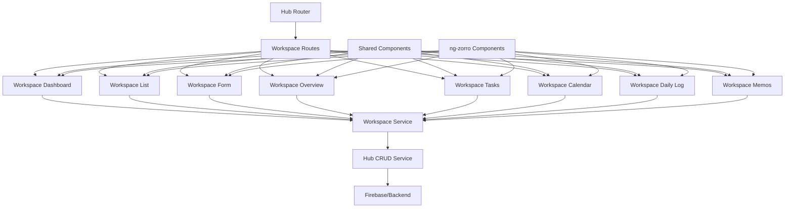
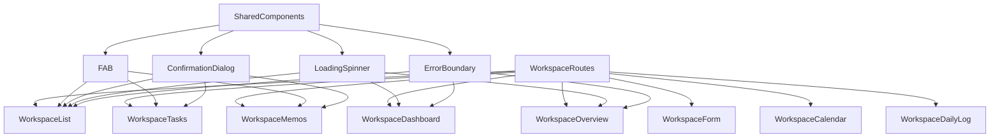
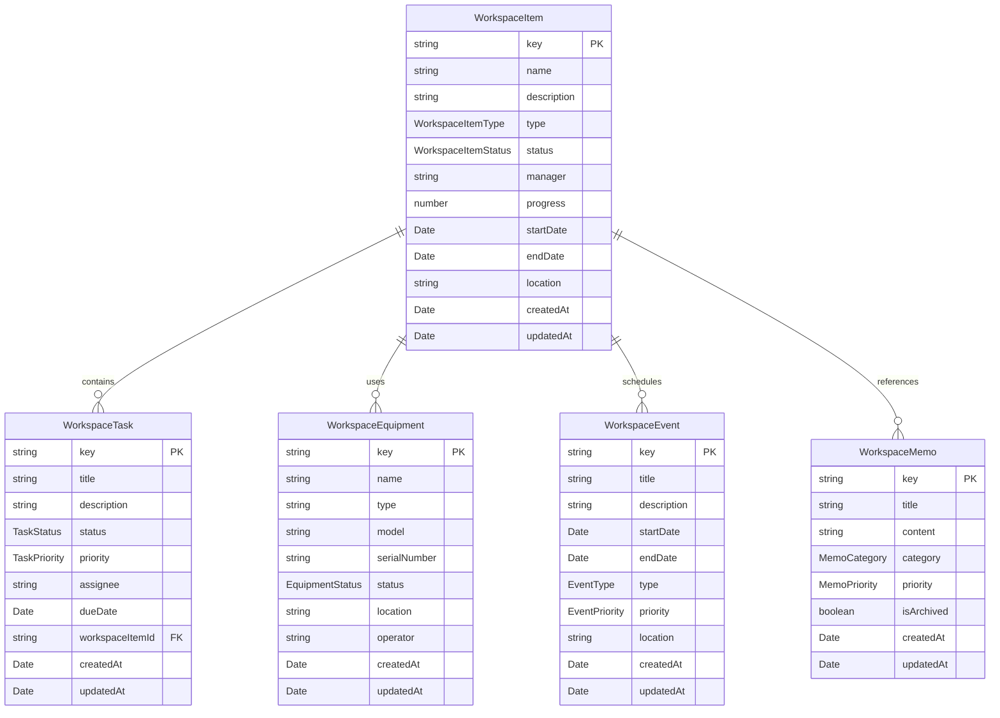
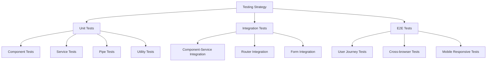

# Design Document

## Overview

本設計文檔詳細描述了 workspace 頁面增強功能的架構設計。基於現有的 hub 架構模式，我們將優化和完善 `/hub/workspace` 頁面的用戶體驗，確保其與 `/hub/contracts`、`/hub/settings` 和 `/hub/tree` 保持一致的設計風格和功能水準。

設計重點包括：
- 統一的單頁應用體驗
- 響應式設計和移動端支持
- 完整的 CRUD 功能實現
- 數據可視化和統計展示
- 無縫的導航和用戶交互

## Architecture

### 整體架構模式



### 路由架構

基於現有的 hub 路由模式，workspace 功能將採用以下路由結構：

```typescript
/hub/workspace/
├── dashboard          # 預設首頁 - 統一儀表板
├── list              # 項目列表管理
├── create            # 創建新項目
├── edit/:id          # 編輯現有項目
├── overview          # 統計概覽
├── tasks             # 任務管理
├── calendar          # 行事曆
├── daily-log         # 施工日誌
└── memos             # 工地備忘錄
```

### 組件層次結構



## Components and Interfaces

### 核心組件設計

#### 1. WorkspaceDashboard Component
**目的**: 提供統一的工作區管理中心和導航入口

**主要功能**:
- 實時統計卡片展示
- 快速操作面板
- 最近活動列表
- 完整功能導航

**ng-zorro 組件使用**:
- `nz-card`: 統計卡片和功能區塊
- `nz-statistic`: 數據統計展示
- `nz-grid`: 響應式佈局
- `nz-button`: 操作按鈕
- `nz-list`: 活動列表
- `nz-tag`: 狀態標籤

#### 2. WorkspaceList Component
**目的**: 提供工作區項目的完整列表管理

**主要功能**:
- 項目列表表格（支援分頁、排序）
- 多條件篩選（類型、狀態、優先級）
- 進度可視化
- FAB 快速新增

**ng-zorro 組件使用**:
- `nz-table`: 數據表格
- `nz-select`: 篩選下拉選單
- `nz-input`: 搜尋輸入框
- `nz-progress`: 進度條
- `nz-tag`: 狀態和類型標籤

#### 3. WorkspaceForm Component
**目的**: 提供項目創建和編輯功能

**主要功能**:
- 響應式表單驗證
- 項目類型選擇
- 日期時間選擇器
- 負責人管理
- 進度追蹤

**ng-zorro 組件使用**:
- `nz-form`: 表單容器
- `nz-input`: 文字輸入
- `nz-select`: 下拉選擇
- `nz-date-picker`: 日期選擇
- `nz-slider`: 進度滑桿

#### 4. WorkspaceTasks Component
**目的**: 提供任務管理系統

**主要功能**:
- 任務 CRUD 操作
- 任務分類和優先級管理
- 截止日期追蹤
- 設備關聯管理

**ng-zorro 組件使用**:
- `nz-table`: 任務列表
- `nz-modal`: 任務編輯彈窗
- `nz-form`: 任務表單
- `nz-tag`: 優先級和狀態標籤

#### 5. WorkspaceCalendar Component
**目的**: 提供工程排程和事件管理

**主要功能**:
- 全功能日曆視圖
- 事件分類和管理
- 事件 CRUD 操作
- 優先級和狀態管理

**ng-zorro 組件使用**:
- `nz-calendar`: 日曆組件
- `nz-badge`: 事件標記
- `nz-modal`: 事件編輯彈窗
- `nz-form`: 事件表單

#### 6. WorkspaceMemos Component
**目的**: 提供工地備忘錄管理

**主要功能**:
- 備忘錄 CRUD 操作
- 備忘錄分類和優先級
- 關鍵字搜尋和篩選
- 確認刪除保護

**ng-zorro 組件使用**:
- `nz-list`: 備忘錄列表
- `nz-modal`: 編輯彈窗
- `nz-form`: 備忘錄表單
- `nz-popconfirm`: 刪除確認

### 介面設計

#### 核心數據模型

```typescript
// 工作區項目介面
interface WorkspaceItem extends AuditableModel {
    name: string;
    description?: string;
    type: WorkspaceItemType;
    status: WorkspaceItemStatus;
    manager: string;
    progress: number;
    startDate?: Date;
    endDate?: Date;
    location?: string;
    equipment?: WorkspaceEquipment[];
    tasks?: WorkspaceTask[];
    metadata?: WorkspaceItemMetadata;
}

// 工作區任務介面
interface WorkspaceTask extends AuditableModel {
    title: string;
    description?: string;
    status: TaskStatus;
    priority: TaskPriority;
    assignee?: string;
    dueDate?: Date;
    workspaceItemId: string;
    dependencies?: string[];
}

// 工作區事件介面
interface WorkspaceEvent extends AuditableModel {
    title: string;
    description?: string;
    startDate: Date;
    endDate?: Date;
    type: EventType;
    priority: EventPriority;
    location?: string;
    attendees?: string[];
}

// 工作區備忘錄介面
interface WorkspaceMemo extends AuditableModel {
    title: string;
    content: string;
    category: MemoCategory;
    priority: MemoPriority;
    tags?: string[];
    isArchived: boolean;
}
```

#### 服務介面設計

```typescript
interface WorkspaceService {
    // 項目管理
    getAllWorkspaceItems(): Observable<WorkspaceItem[]>;
    getWorkspaceItemById(id: string): Observable<WorkspaceItem | undefined>;
    createWorkspaceItem(item: Omit<WorkspaceItem, 'key'>): Promise<string>;
    updateWorkspaceItem(id: string, updates: Partial<WorkspaceItem>): Promise<void>;
    deleteWorkspaceItem(id: string): Promise<void>;
    
    // 任務管理
    getTasksByWorkspaceItem(workspaceItemId: string): Observable<WorkspaceTask[]>;
    createTask(task: Omit<WorkspaceTask, 'key'>): Promise<string>;
    updateTask(id: string, updates: Partial<WorkspaceTask>): Promise<void>;
    deleteTask(id: string): Promise<void>;
    
    // 事件管理
    getEventsByDateRange(startDate: Date, endDate: Date): Observable<WorkspaceEvent[]>;
    createEvent(event: Omit<WorkspaceEvent, 'key'>): Promise<string>;
    updateEvent(id: string, updates: Partial<WorkspaceEvent>): Promise<void>;
    deleteEvent(id: string): Promise<void>;
    
    // 備忘錄管理
    getAllMemos(): Observable<WorkspaceMemo[]>;
    createMemo(memo: Omit<WorkspaceMemo, 'key'>): Promise<string>;
    updateMemo(id: string, updates: Partial<WorkspaceMemo>): Promise<void>;
    deleteMemo(id: string): Promise<void>;
    
    // 統計和搜尋
    getWorkspaceStatistics(): Promise<WorkspaceStatistics>;
    searchWorkspaceItems(keyword: string): Observable<WorkspaceItem[]>;
}
```

## Data Models

### 數據模型層次結構



### 枚舉類型定義

```typescript
// 工作區項目類型
export type WorkspaceItemType = '工地項目' | '設備管理' | '施工區域' | '運輸任務';

// 工作區項目狀態
export type WorkspaceItemStatus = 'pending' | 'in-progress' | 'active' | 'maintenance' | 'completed' | 'cancelled';

// 任務狀態
export type TaskStatus = 'pending' | 'in-progress' | 'completed' | 'cancelled';

// 任務優先級
export type TaskPriority = 'low' | 'medium' | 'high' | 'urgent';

// 事件類型
export type EventType = '施工' | '設備' | '安全' | '維護' | '會議';

// 事件優先級
export type EventPriority = 'low' | 'medium' | 'high' | 'urgent';

// 備忘錄分類
export type MemoCategory = '安全' | '設備' | '施工' | '緊急' | '一般';

// 備忘錄優先級
export type MemoPriority = 'low' | 'medium' | 'high';

// 設備狀態
export type EquipmentStatus = 'available' | 'in-use' | 'maintenance' | 'retired';
```

## Error Handling

### 錯誤處理策略

#### 1. 服務層錯誤處理

```typescript
// 統一錯誤處理服務
interface ErrorHandlingService {
    handleServiceError(error: any, operation: string): Observable<never>;
    showErrorMessage(message: string): void;
    showSuccessMessage(message: string): void;
    logError(error: any, context: string): void;
}

// 實現範例
async createWorkspaceItem(item: Omit<WorkspaceItem, 'key'>): Promise<string> {
    try {
        const result = await this.hubCrud.add<WorkspaceItem>(this.WORKSPACE_COLLECTION, item);
        this.errorHandler.showSuccessMessage('工作區項目創建成功');
        return result;
    } catch (error) {
        this.errorHandler.logError(error, 'createWorkspaceItem');
        this.errorHandler.showErrorMessage('創建工作區項目失敗，請稍後再試');
        throw error;
    }
}
```

#### 2. 組件層錯誤處理

```typescript
// 組件錯誤處理模式
@Component({...})
export class WorkspaceListComponent {
    loading = signal(false);
    error = signal<string | null>(null);
    
    async loadWorkspaceItems() {
        this.loading.set(true);
        this.error.set(null);
        
        try {
            const items = await this.workspaceService.getAllWorkspaceItems().toPromise();
            this.workspaceItems.set(items || []);
        } catch (error) {
            this.error.set('載入工作區項目失敗');
            console.error('Error loading workspace items:', error);
        } finally {
            this.loading.set(false);
        }
    }
}
```

#### 3. 表單驗證錯誤處理

```typescript
// 表單驗證錯誤處理
interface FormValidationError {
    field: string;
    message: string;
    type: 'required' | 'pattern' | 'min' | 'max' | 'custom';
}

// 驗證規則
const workspaceItemValidators = {
    name: [Validators.required, Validators.minLength(2), Validators.maxLength(100)],
    type: [Validators.required],
    manager: [Validators.required],
    progress: [Validators.min(0), Validators.max(100)]
};
```

### 用戶反饋機制

#### 1. 載入狀態
- 使用 `nz-spin` 組件顯示載入狀態
- 骨架屏 (Skeleton) 用於數據載入
- 進度條用於長時間操作

#### 2. 成功反饋
- 使用 `nz-message` 顯示操作成功訊息
- 使用 `nz-notification` 顯示重要通知
- 視覺反饋（顏色變化、動畫效果）

#### 3. 錯誤反饋
- 表單驗證錯誤即時顯示
- 網路錯誤統一處理和顯示
- 提供重試機制

## Testing Strategy

### 測試架構



### 單元測試策略

#### 1. 組件測試
```typescript
describe('WorkspaceDashboardComponent', () => {
    let component: WorkspaceDashboardComponent;
    let fixture: ComponentFixture<WorkspaceDashboardComponent>;
    let mockWorkspaceService: jasmine.SpyObj<WorkspaceService>;

    beforeEach(() => {
        const spy = jasmine.createSpyObj('WorkspaceService', ['getAllWorkspaceItems', 'getWorkspaceStatistics']);
        
        TestBed.configureTestingModule({
            imports: [WorkspaceDashboardComponent],
            providers: [
                { provide: WorkspaceService, useValue: spy }
            ]
        });
        
        fixture = TestBed.createComponent(WorkspaceDashboardComponent);
        component = fixture.componentInstance;
        mockWorkspaceService = TestBed.inject(WorkspaceService) as jasmine.SpyObj<WorkspaceService>;
    });

    it('should create', () => {
        expect(component).toBeTruthy();
    });

    it('should load dashboard statistics on init', () => {
        const mockStats = { totalItems: 10, activeTasks: 5, safetyChecks: 95, equipmentStatus: 88 };
        mockWorkspaceService.getWorkspaceStatistics.and.returnValue(Promise.resolve(mockStats));
        
        component.ngOnInit();
        
        expect(mockWorkspaceService.getWorkspaceStatistics).toHaveBeenCalled();
    });
});
```

#### 2. 服務測試
```typescript
describe('WorkspaceService', () => {
    let service: WorkspaceService;
    let mockHubCrud: jasmine.SpyObj<HubCrudService>;

    beforeEach(() => {
        const spy = jasmine.createSpyObj('HubCrudService', ['add', 'update', 'delete', 'useCollection', 'useDoc']);
        
        TestBed.configureTestingModule({
            providers: [
                WorkspaceService,
                { provide: HubCrudService, useValue: spy }
            ]
        });
        
        service = TestBed.inject(WorkspaceService);
        mockHubCrud = TestBed.inject(HubCrudService) as jasmine.SpyObj<HubCrudService>;
    });

    it('should create workspace item', async () => {
        const mockItem: Omit<WorkspaceItem, 'key'> = {
            name: 'Test Item',
            type: '工地項目',
            status: 'pending',
            manager: 'Test Manager',
            progress: 0,
            createdAt: new Date(),
            updatedAt: new Date()
        };
        
        mockHubCrud.add.and.returnValue(Promise.resolve('test-id'));
        
        const result = await service.createWorkspaceItem(mockItem);
        
        expect(result).toBe('test-id');
        expect(mockHubCrud.add).toHaveBeenCalledWith('hub_workspace_items', jasmine.objectContaining(mockItem));
    });
});
```

### 整合測試策略

#### 1. 組件-服務整合測試
- 測試組件與服務之間的數據流
- 驗證錯誤處理機制
- 確保狀態管理正確性

#### 2. 路由整合測試
- 測試路由導航功能
- 驗證路由參數傳遞
- 確保懶載入正常工作

### E2E 測試策略

#### 1. 用戶旅程測試
```typescript
describe('Workspace Management E2E', () => {
    it('should allow user to create, edit, and delete workspace item', () => {
        // 導航到工作區列表
        cy.visit('/hub/workspace/list');
        
        // 點擊新增按鈕
        cy.get('[data-cy=fab-add]').click();
        
        // 填寫表單
        cy.get('[data-cy=workspace-name]').type('測試工作區項目');
        cy.get('[data-cy=workspace-type]').select('工地項目');
        cy.get('[data-cy=workspace-manager]').type('測試負責人');
        
        // 提交表單
        cy.get('[data-cy=submit-button]').click();
        
        // 驗證創建成功
        cy.contains('工作區項目創建成功').should('be.visible');
        cy.url().should('include', '/hub/workspace/list');
        
        // 驗證項目出現在列表中
        cy.contains('測試工作區項目').should('be.visible');
    });
});
```

### 測試覆蓋率目標

- **單元測試覆蓋率**: ≥ 80%
- **整合測試覆蓋率**: ≥ 70%
- **E2E 測試覆蓋率**: ≥ 60%
- **關鍵路徑覆蓋率**: 100%

### 測試工具和框架

- **單元測試**: Jasmine + Karma
- **整合測試**: Angular Testing Utilities
- **E2E 測試**: Cypress
- **測試覆蓋率**: Istanbul/nyc
- **模擬數據**: Angular Testing SpyObj

這個設計確保了 workspace 頁面增強功能能夠提供高品質、可維護且用戶友好的體驗，同時與現有的 hub 架構完美整合。