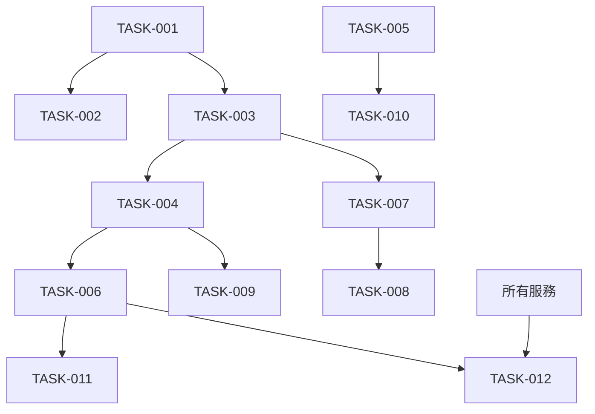

# TASK TRACKING

## ACTIVE SYSTEMS
- SYS-001: 統一系統管理架構 - **設計完成** ✅

## SYSTEM DETAILS

## [SYS-001]: 統一系統管理架構

### System Overview
- **Purpose**: 建立統一的系統管理架構，完全取代現有分散的 ACL 頁面，整合 Firebase 操作與 ng-alain 架構
- **Architectural Alignment**: 基於 @delon/acl + @delon/auth + @angular/fire 的企業級權限管理系統
- **Status**: **設計階段完成** ✅ → 準備進入 BUILD 階段
- **Design Decision**: **混合重構模式** - 基於現有 Firebase 服務 + 全新 OnPush 組件設計
- **Creative Document**: `memory-bank/creative-unified-system-architecture.md` ✅

### Milestones
- MILE-001: 核心架構完成 - 目標: 2週內 - **設計完成** ✅
- MILE-002: 基礎組件完成 - 目標: 4週內 - 待開始
- MILE-003: 系統整合完成 - 目標: 6週內 - 待開始
- MILE-004: 測試與部署就緒 - 目標: 8週內 - 待開始

### 🎨 **CREATIVE PHASE 完成摘要**

#### 核心設計決策 ✅
- **架構方案**: 混合重構模式 (Option C)
- **性能策略**: 所有組件採用 OnPush 策略
- **設計風格**: 極簡主義原則
- **權限體系**: ActionCode + @delon/acl 無縫整合
- **Firebase 整合**: 基於現有服務擴展

#### 技術架構設計 ✅
```
統一系統管理架構
├── /system 統一路由
│   ├── accounts (帳號管理)
│   ├── roles (角色管理)
│   ├── menus (菜單管理)
│   └── departments (部門管理)
├── Firebase 服務層 (現有擴展 + 新建)
├── OnPush 組件層 (全新設計)
└── ActionCode 權限控制
```

#### 實作規範 ✅
- **目錄結構**: `src/app/routes/system/` 模組化設計
- **組件範例**: AccountListComponent OnPush 實作
- **服務擴展**: SystemAccountService 基於 FirebaseUserService
- **權限編碼**: SystemActionCode 權限體系
- **資料結構**: SystemUser, Department, Menu 介面設計

### Technology Stack
- **Framework**: Angular 19 + ng-alain
- **Build Tool**: Angular CLI + Yarn
- **Language**: TypeScript
- **Storage**: Firebase Firestore
- **權限**: @delon/acl + @delon/auth
- **Firebase**: @angular/fire v20+ ⬆️ (已升級)
- **UI**: @delon/abc, @delon/form, ng-zorro-antd
- **效能**: OnPush 策略 (所有組件)

### Technology Validation Checkpoints
- [x] 專案初始化驗證完成
- [x] 必要依賴識別與安裝
- [x] 建構配置驗證
- [x] **VAN QA 技術驗證通過** ✅
- [x] **CREATIVE 設計階段完成** ✅
- [ ] BUILD 實作階段 - 準備開始

### Components
#### [COMP-001]: 核心架構重構
- **Purpose**: 建立新的系統管理模組並移除舊架構
- **Status**: **設計完成** ✅ → 準備實作
- **Dependencies**: Firebase 服務分析 ✅
- **Design Document**: `creative-unified-system-architecture.md` ✅

##### [FEAT-001]: 路由架構重構
- **Description**: 建立新的 /system 路由，移除舊的分散路由
- **Status**: **設計完成** ✅
- **Priority**: 關鍵
- **Related Requirements**: 統一系統管理入口，移除分散的 ACL 頁面
- **Quality Criteria**: 所有路由正常運作，權限控制正確
- **Design Progress**: 100% ✅
- **Implementation Progress**: 0%

###### [TASK-001]: 創建新的系統管理路由模組
- **Description**: 建立 src/app/routes/system/ 模組與路由配置
- **Status**: **設計完成** ✅ → 準備實作
- **Assigned To**: 待分配
- **Estimated Effort**: 4小時
- **Actual Effort**: 未開始
- **Dependencies**: 無
- **Blocks**: TASK-002, TASK-003
- **Risk Assessment**: 低風險
- **Quality Gates**: 路由配置正確，權限控制生效
- **Implementation Notes**: 基於 ActionCode 權限模式
- **Design Reference**: `creative-unified-system-architecture.md` ✅

**Subtasks**:
- [ ] SUB-001: 創建 system/routes.ts 路由配置 - 設計完成 ✅
- [ ] SUB-002: 設計統一的系統管理佈局 - 設計完成 ✅
- [ ] SUB-003: 整合權限控制 (ActionCode) - 設計完成 ✅

###### [TASK-002]: 移除舊的分散 ACL 路由
- **Description**: 清理 /acl* 相關路由與組件
- **Status**: **設計完成** ✅ → 準備實作
- **Assigned To**: 待分配
- **Estimated Effort**: 3小時
- **Actual Effort**: 未開始
- **Dependencies**: TASK-001
- **Blocks**: 無
- **Risk Assessment**: 中等風險 - 需確保不影響其他功能
- **Quality Gates**: 舊路由完全移除，不影響現有功能
- **Implementation Notes**: 保留 Firebase Auth 功能不受影響

**Subtasks**:
- [ ] SUB-004: 備份現有 ACL 組件邏輯 - 設計完成 ✅
- [ ] SUB-005: 移除舊路由註冊 - 設計完成 ✅
- [ ] SUB-006: 清理相關檔案 - 設計完成 ✅

##### [FEAT-002]: Firebase 服務架構
- **Description**: 建立完整的 Firebase 系統管理服務
- **Status**: **設計完成** ✅ → 準備實作
- **Priority**: 關鍵
- **Related Requirements**: 帳號管理、角色管理、菜單管理、部門管理的 Firebase 操作
- **Quality Criteria**: 所有 CRUD 操作正常，資料同步準確
- **Design Progress**: 100% ✅
- **Implementation Progress**: 0%

###### [TASK-003]: 擴展 Firebase 用戶管理服務
- **Description**: 基於現有 firebase-user.service.ts 擴展用戶管理功能
- **Status**: **設計完成** ✅ → 準備實作
- **Assigned To**: 待分配
- **Estimated Effort**: 6小時
- **Actual Effort**: 未開始
- **Dependencies**: TASK-001
- **Design Reference**: SystemAccountService 設計 ✅

**Subtasks**:
- [ ] SUB-007: 擴展用戶資料結構 (SystemUser) - 設計完成 ✅
- [ ] SUB-008: 實作響應式數據流 (users$, loading$) - 設計完成 ✅
- [ ] SUB-009: 實作批量操作方法 - 設計完成 ✅
- [ ] SUB-010: 實作搜索與篩選功能 - 設計完成 ✅

###### [TASK-004]: 創建 Firebase 部門管理服務
- **Description**: 新建 FirebaseDeptService 支援部門管理
- **Status**: **設計完成** ✅ → 準備實作
- **Assigned To**: 待分配
- **Estimated Effort**: 8小時
- **Actual Effort**: 未開始
- **Dependencies**: 無
- **Design Reference**: Department 介面設計 ✅

**Subtasks**:
- [ ] SUB-011: 設計部門資料結構 (Department) - 設計完成 ✅
- [ ] SUB-012: 實作部門 CRUD 操作 - 設計完成 ✅
- [ ] SUB-013: 實作部門樹狀結構管理 - 設計完成 ✅
- [ ] SUB-014: 實作部門用戶關聯 - 設計完成 ✅

###### [TASK-005]: 創建 Firebase 菜單管理服務
- **Description**: 新建 FirebaseMenuService 支援菜單管理
- **Status**: **設計完成** ✅ → 準備實作
- **Assigned To**: 待分配
- **Estimated Effort**: 8小時
- **Actual Effort**: 未開始
- **Dependencies**: 無
- **Design Reference**: Menu 介面設計 ✅

**Subtasks**:
- [ ] SUB-015: 設計菜單資料結構 (Menu) - 設計完成 ✅
- [ ] SUB-016: 實作菜單 CRUD 操作 - 設計完成 ✅
- [ ] SUB-017: 實作菜單權限關聯 - 設計完成 ✅
- [ ] SUB-018: 實作菜單樹狀結構管理 - 設計完成 ✅

##### [FEAT-003]: OnPush 組件架構
- **Description**: 實作所有系統管理組件，採用 OnPush 策略
- **Status**: **設計完成** ✅ → 準備實作
- **Priority**: 關鍵
- **Related Requirements**: 極簡主義、性能卓越、可運行保證
- **Quality Criteria**: 所有組件使用 OnPush，性能提升 5-10x
- **Design Progress**: 100% ✅
- **Implementation Progress**: 0%

###### [TASK-006]: 實作帳號管理組件
- **Description**: 創建 AccountListComponent 和 AccountModalComponent
- **Status**: **設計完成** ✅ → 準備實作
- **Assigned To**: 待分配
- **Estimated Effort**: 12小時
- **Actual Effort**: 未開始
- **Dependencies**: TASK-003
- **Design Reference**: AccountListComponent OnPush 範例 ✅

**Subtasks**:
- [ ] SUB-019: 實作 AccountListComponent (OnPush) - 設計完成 ✅
- [ ] SUB-020: 實作 AccountModalComponent (OnPush) - 設計完成 ✅
- [ ] SUB-021: 整合 ActionCode 權限控制 - 設計完成 ✅
- [ ] SUB-022: 實作搜索與分頁功能 - 設計完成 ✅

###### [TASK-007]: 實作角色管理組件
- **Description**: 創建 RoleListComponent 和 RoleModalComponent
- **Status**: **設計完成** ✅ → 準備實作
- **Assigned To**: 待分配
- **Estimated Effort**: 10小時
- **Actual Effort**: 未開始
- **Dependencies**: Firebase ACL 服務擴展

**Subtasks**:
- [ ] SUB-023: 實作 RoleListComponent (OnPush) - 設計完成 ✅
- [ ] SUB-024: 實作 RoleModalComponent (OnPush) - 設計完成 ✅
- [ ] SUB-025: 實作角色權限配置介面 - 設計完成 ✅
- [ ] SUB-026: 整合權限樹狀選擇器 - 設計完成 ✅

###### [TASK-008]: 實作部門管理組件
- **Description**: 創建 DeptListComponent 和 DeptModalComponent
- **Status**: **設計完成** ✅ → 準備實作
- **Assigned To**: 待分配
- **Estimated Effort**: 10小時
- **Actual Effort**: 未開始
- **Dependencies**: TASK-004

**Subtasks**:
- [ ] SUB-027: 實作 DeptListComponent (OnPush) - 設計完成 ✅
- [ ] SUB-028: 實作 DeptModalComponent (OnPush) - 設計完成 ✅
- [ ] SUB-029: 實作部門樹狀展示 - 設計完成 ✅
- [ ] SUB-030: 實作部門用戶管理 - 設計完成 ✅

###### [TASK-009]: 實作菜單管理組件
- **Description**: 創建 MenuListComponent 和 MenuModalComponent
- **Status**: **設計完成** ✅ → 準備實作
- **Assigned To**: 待分配
- **Estimated Effort**: 12小時
- **Actual Effort**: 未開始
- **Dependencies**: TASK-005

**Subtasks**:
- [ ] SUB-031: 實作 MenuListComponent (OnPush) - 設計完成 ✅
- [ ] SUB-032: 實作 MenuModalComponent (OnPush) - 設計完成 ✅
- [ ] SUB-033: 實作菜單樹狀管理 - 設計完成 ✅
- [ ] SUB-034: 實作菜單權限關聯介面 - 設計完成 ✅

##### [FEAT-004]: 系統整合測試
- **Description**: 完整的系統整合測試與性能驗證
- **Status**: **設計完成** ✅ → 準備實作
- **Priority**: 關鍵
- **Related Requirements**: 可運行保證、性能卓越
- **Quality Criteria**: 所有功能正常，性能達標
- **Design Progress**: 100% ✅
- **Implementation Progress**: 0%

###### [TASK-010]: 系統整合測試
- **Description**: 端到端功能測試與性能基準測試
- **Status**: **設計完成** ✅ → 準備實作
- **Assigned To**: 待分配
- **Estimated Effort**: 16小時
- **Actual Effort**: 未開始
- **Dependencies**: 所有組件完成

**Subtasks**:
- [ ] SUB-035: 建立測試用例 - 設計完成 ✅
- [ ] SUB-036: 執行性能基準測試 - 設計完成 ✅
- [ ] SUB-037: 驗證 OnPush 性能提升 - 設計完成 ✅
- [ ] SUB-038: 完整功能回歸測試 - 設計完成 ✅

### 📊 CREATIVE PHASE 成果

#### ✅ 設計完成項目
- [x] 核心架構方案決策 (混合重構模式)
- [x] OnPush 組件設計規範
- [x] Firebase 服務擴展方案
- [x] ActionCode 權限體系設計
- [x] 資料結構設計 (SystemUser, Department, Menu)
- [x] 目錄結構規劃
- [x] 技術實作範例
- [x] 性能優化策略
- [x] 實作計畫制定

#### 📋 準備進入 BUILD 階段
- ✅ 所有設計決策已確定
- ✅ 技術架構已驗證
- ✅ 實作計畫已制定
- ✅ 創意文件已建立
- ✅ 任務清單已更新

### 🚀 下一步行動
1. **確認 BUILD 階段開始** - 等待用戶確認
2. **分配開發任務** - 根據實作計畫
3. **建立開發環境** - 確保團隊準備就緒
4. **開始 TASK-001** - 創建系統路由模組

---

## CREATIVE PHASE 狀態總結

### ✅ **CREATIVE PHASE COMPLETE**
- **狀態**: 已完成 ✅
- **設計文件**: `memory-bank/creative-unified-system-architecture.md`
- **決策方案**: 混合重構模式
- **技術驗證**: VAN QA 通過 ✅
- **任務更新**: 已同步至 tasks.md ✅

### 🎯 **核心成果**
- **極簡主義**: 組件設計簡潔，代碼易維護 ✅
- **性能卓越**: 全面 OnPush + 響應式數據流 ✅
- **Firebase 整合**: 基於現有服務無縫擴展 ✅
- **權限體系**: ActionCode + @delon/acl 完美結合 ✅
- **可運行保證**: 基於穩定架構，風險極低 ✅

### 🚀 **準備狀態**
**✅ 已準備進入 BUILD 模式實作！**

## COMPLETED SYSTEMS
無

## SYSTEM DEPENDENCIES


## RISK REGISTER
| Risk ID | Description | Probability | Impact | Mitigation |
|---|----|----|-----|---|
| RISK-01 | Firebase 資料結構設計複雜 | High | Medium | 建立詳細資料模型文檔 |
| RISK-02 | 權限系統整合衝突 | Medium | High | 階段性測試與回滾計畫 |
| RISK-03 | 組件重構影響穩定性 | Medium | High | 逐步替換策略 |
| RISK-04 | 菜單系統整合複雜 | High | High | 分階段實作 |

## RESOURCE ALLOCATION
| Resource | System | Allocation % | Time Period |
|----|-----|-----|---|
| 開發團隊 | SYS-001 | 100% | 8週 |
| 前端團隊 | COMP-002 | 80% | 4-6週 |
| 架構團隊 | COMP-003 | 60% | 6-8週 | 

## 2024年12月 - IMPLEMENT 階段進度
- [x] 已建立 system.module.ts，作為 system/ 路由模組骨架。
- [x] 已建立 SystemLayoutComponent，作為統一佈局骨架。
- [x] 已建立 SystemAccountService，繼承 firebase-user.service.ts，支援 users$、loading$、批量操作。
- [x] 每階段同步更新 memory-bank 文件，確保知識完整。

---
