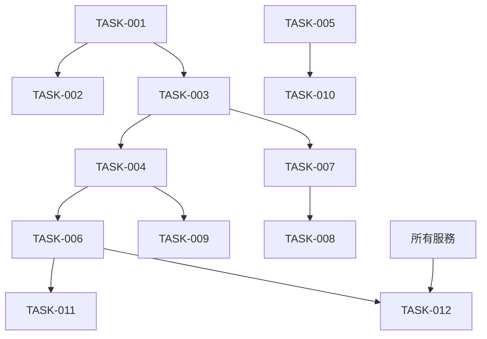

# TASK TRACKING

## ACTIVE SYSTEMS
- SYS-001: 統一系統管理架構 - 規劃中

## SYSTEM DETAILS

## [SYS-001]: 統一系統管理架構

### System Overview
- **Purpose**: 建立統一的系統管理架構，完全取代現有分散的 ACL 頁面，整合 Firebase 操作與 ng-alain 架構
- **Architectural Alignment**: 基於 @delon/acl + @delon/auth + @angular/fire 的企業級權限管理系統
- **Status**: 規劃中
- **Milestones**: 
  - MILE-001: 核心架構完成 - 目標: 2週內 - 未開始
  - MILE-002: 基礎組件完成 - 目標: 4週內 - 未開始
  - MILE-003: 系統整合完成 - 目標: 6週內 - 未開始
  - MILE-004: 測試與部署就緒 - 目標: 8週內 - 未開始

### Technology Stack
- **Framework**: Angular 19 + ng-alain
- **Build Tool**: Angular CLI + Yarn
- **Language**: TypeScript
- **Storage**: Firebase Firestore
- **權限**: @delon/acl + @delon/auth
- **Firebase**: @angular/fire v18+
- **UI**: @delon/abc, @delon/form, ng-zorro-antd
- **效能**: OnPush 策略

### Technology Validation Checkpoints
- [x] 專案初始化驗證完成
- [x] 必要依賴識別與安裝
- [x] 建構配置驗證
- [ ] Hello world 驗證待完成
- [ ] 測試建構通過

### Components
#### [COMP-001]: 核心架構重構
- **Purpose**: 建立新的系統管理模組並移除舊架構
- **Status**: 規劃中
- **Dependencies**: Firebase 服務分析
- **Responsible**: 開發團隊

##### [FEAT-001]: 路由架構重構
- **Description**: 建立新的 /system 路由，移除舊的分散路由
- **Status**: 規劃中
- **Priority**: 關鍵
- **Related Requirements**: 統一系統管理入口，移除分散的 ACL 頁面
- **Quality Criteria**: 所有路由正常運作，權限控制正確
- **Progress**: 0%

###### [TASK-001]: 創建新的系統管理路由模組
- **Description**: 建立 src/app/routes/system/ 模組與路由配置
- **Status**: TODO
- **Assigned To**: 待分配
- **Estimated Effort**: 4小時
- **Actual Effort**: 未開始
- **Dependencies**: 無
- **Blocks**: TASK-002, TASK-003
- **Risk Assessment**: 低風險
- **Quality Gates**: 路由配置正確，權限控制生效
- **Implementation Notes**: 基於 ui-example 的 ActionCode 權限模式

**Subtasks**:
- [ ] SUB-001: 創建 system/routes.ts 路由配置 - TODO
- [ ] SUB-002: 設計統一的系統管理佈局 - TODO
- [ ] SUB-003: 整合權限控制 (ActionCode) - TODO

###### [TASK-002]: 移除舊的分散 ACL 路由
- **Description**: 清理 /acl* 相關路由與組件
- **Status**: TODO
- **Assigned To**: 待分配
- **Estimated Effort**: 3小時
- **Actual Effort**: 未開始
- **Dependencies**: TASK-001
- **Blocks**: 無
- **Risk Assessment**: 中等風險 - 需確保不影響其他功能
- **Quality Gates**: 舊路由完全移除，不影響現有功能
- **Implementation Notes**: 保留 Firebase Auth 功能不受影響

**Subtasks**:
- [ ] SUB-004: 備份現有 ACL 組件邏輯 - TODO
- [ ] SUB-005: 移除舊路由註冊 - TODO
- [ ] SUB-006: 清理相關檔案 - TODO

##### [FEAT-002]: Firebase 服務架構
- **Description**: 建立完整的 Firebase 系統管理服務
- **Status**: 規劃中
- **Priority**: 關鍵
- **Related Requirements**: 帳號管理、角色管理、菜單管理、部門管理的 Firebase 操作
- **Quality Criteria**: 所有 CRUD 操作正常，資料同步準確
- **Progress**: 0%

###### [TASK-003]: 擴展 Firebase 用戶管理服務
- **Description**: 基於現有 firebase-user.service.ts 擴展用戶管理功能
- **Status**: TODO
- **Assigned To**: 待分配
- **Estimated Effort**: 6小時
- **Actual Effort**: 未開始
- **Dependencies**: TASK-001
- **Blocks**: TASK-007, TASK-008
- **Risk Assessment**: 中等風險 - Firebase 資料結構設計複雜
- **Quality Gates**: 用戶 CRUD 操作完整，與部門關聯正確
- **Implementation Notes**: 整合批量操作功能

**Subtasks**:
- [ ] SUB-007: 設計用戶資料結構 (與部門關聯) - TODO
- [ ] SUB-008: 實作用戶 CRUD 操作 - TODO
- [ ] SUB-009: 整合批量操作 (啟用/停用/重設密碼) - TODO

###### [TASK-004]: 建立角色管理 Firebase 服務
- **Description**: 創建角色管理的 Firebase 操作服務
- **Status**: TODO
- **Assigned To**: 待分配
- **Estimated Effort**: 5小時
- **Actual Effort**: 未開始
- **Dependencies**: TASK-003
- **Blocks**: TASK-009, TASK-006
- **Risk Assessment**: 中等風險
- **Quality Gates**: 角色 CRUD 操作完整，權限分配邏輯正確
- **Implementation Notes**: 基於 @delon/acl 權限模型

**Subtasks**:
- [ ] SUB-010: 設計角色資料結構 - TODO
- [ ] SUB-011: 實作角色 CRUD 操作 - TODO
- [ ] SUB-012: 整合權限分配邏輯 - TODO

###### [TASK-005]: 建立部門管理 Firebase 服務
- **Description**: 創建部門層級管理的 Firebase 操作服務
- **Status**: TODO
- **Assigned To**: 待分配
- **Estimated Effort**: 5小時
- **Actual Effort**: 未開始
- **Dependencies**: 無
- **Blocks**: TASK-010, TASK-003
- **Risk Assessment**: 中等風險
- **Quality Gates**: 部門樹狀結構正確，用戶關聯功能正常
- **Implementation Notes**: 支援多層級部門結構

**Subtasks**:
- [ ] SUB-013: 設計部門樹狀結構 - TODO
- [ ] SUB-014: 實作部門 CRUD 操作 - TODO
- [ ] SUB-015: 整合用戶-部門關聯 - TODO

###### [TASK-006]: 建立菜單管理 Firebase 服務
- **Description**: 動態菜單管理與權限整合
- **Status**: TODO
- **Assigned To**: 待分配
- **Estimated Effort**: 6小時
- **Actual Effort**: 未開始
- **Dependencies**: TASK-004
- **Blocks**: TASK-011, TASK-012
- **Risk Assessment**: 高風險 - 需與 ng-alain 菜單系統深度整合
- **Quality Gates**: 菜單動態載入正確，權限整合無誤
- **Implementation Notes**: 與 startup.service.ts 深度整合

**Subtasks**:
- [ ] SUB-016: 設計菜單樹狀結構 - TODO
- [ ] SUB-017: 實作菜單 CRUD 操作 - TODO
- [ ] SUB-018: 整合 ng-alain 菜單系統 - TODO

#### [COMP-002]: 系統管理組件
- **Purpose**: 建立高效能的系統管理 UI 組件
- **Status**: 規劃中
- **Dependencies**: COMP-001 完成
- **Responsible**: 前端團隊

##### [FEAT-003]: 用戶管理組件
- **Description**: 完整的用戶管理界面 (列表/新增/編輯/權限)
- **Status**: 規劃中
- **Priority**: 高
- **Related Requirements**: 用戶帳號管理功能
- **Quality Criteria**: OnPush 策略，響應式設計
- **Progress**: 0%

###### [TASK-007]: 用戶列表主組件
- **Description**: 基於 st 組件的高效能用戶列表
- **Status**: TODO
- **Assigned To**: 待分配
- **Estimated Effort**: 8小時
- **Actual Effort**: 未開始
- **Dependencies**: TASK-003
- **Blocks**: TASK-008
- **Risk Assessment**: 低風險
- **Quality Gates**: 列表效能良好，搜尋篩選功能完整
- **Implementation Notes**: 使用 OnPush 策略提升效能

**Subtasks**:
- [ ] SUB-019: 設計用戶列表模板 (搜尋/篩選/分頁) - TODO
- [ ] SUB-020: 整合批量操作功能 - TODO
- [ ] SUB-021: 實作部門篩選與用戶角色顯示 - TODO

###### [TASK-008]: 用戶彈窗組件
- **Description**: 用戶新增/編輯的彈窗組件
- **Status**: TODO
- **Assigned To**: 待分配
- **Estimated Effort**: 6小時
- **Actual Effort**: 未開始
- **Dependencies**: TASK-007
- **Blocks**: 無
- **Risk Assessment**: 低風險
- **Quality Gates**: 表單驗證完整，用戶體驗良好
- **Implementation Notes**: 基於 @delon/form 響應式表單

**Subtasks**:
- [ ] SUB-022: 設計響應式表單 - TODO
- [ ] SUB-023: 整合部門選擇器 - TODO
- [ ] SUB-024: 實作角色分配界面 - TODO

##### [FEAT-004]: 角色管理組件
- **Description**: 角色管理與權限分配界面
- **Status**: 規劃中
- **Priority**: 高
- **Related Requirements**: 角色權限管理功能
- **Quality Criteria**: 直觀的權限樹狀結構
- **Progress**: 0%

###### [TASK-009]: 角色列表與權限分配
- **Description**: 角色管理主界面
- **Status**: TODO
- **Assigned To**: 待分配
- **Estimated Effort**: 8小時
- **Actual Effort**: 未開始
- **Dependencies**: TASK-004
- **Blocks**: 無
- **Risk Assessment**: 中等風險
- **Quality Gates**: 權限樹狀結構直觀，權限分配功能完整
- **Implementation Notes**: 整合 @delon/acl 權限模型

**Subtasks**:
- [ ] SUB-025: 設計角色列表界面 - TODO
- [ ] SUB-026: 實作權限樹狀選擇器 - TODO
- [ ] SUB-027: 整合權限預覽功能 - TODO

##### [FEAT-005]: 部門管理組件
- **Description**: 層級化部門管理界面
- **Status**: 規劃中
- **Priority**: 中等
- **Related Requirements**: 部門層級管理功能
- **Quality Criteria**: 支援拖拽排序，樹狀結構
- **Progress**: 0%

###### [TASK-010]: 部門樹狀管理組件
- **Description**: 部門層級管理界面
- **Status**: TODO
- **Assigned To**: 待分配
- **Estimated Effort**: 7小時
- **Actual Effort**: 未開始
- **Dependencies**: TASK-005
- **Blocks**: 無
- **Risk Assessment**: 中等風險
- **Quality Gates**: 樹狀結構操作流暢，拖拽功能穩定
- **Implementation Notes**: 使用 ng-zorro-antd tree 組件

**Subtasks**:
- [ ] SUB-028: 實作部門樹狀組件 - TODO
- [ ] SUB-029: 整合拖拽排序功能 - TODO
- [ ] SUB-030: 實作部門成員管理 - TODO

##### [FEAT-006]: 菜單管理組件
- **Description**: 動態菜單配置界面
- **Status**: 規劃中
- **Priority**: 中等
- **Related Requirements**: 動態菜單管理功能
- **Quality Criteria**: 即時預覽，權限整合
- **Progress**: 0%

###### [TASK-011]: 菜單配置組件
- **Description**: 動態菜單管理界面
- **Status**: TODO
- **Assigned To**: 待分配
- **Estimated Effort**: 8小時
- **Actual Effort**: 未開始
- **Dependencies**: TASK-006
- **Blocks**: 無
- **Risk Assessment**: 高風險 - 需與系統菜單深度整合
- **Quality Gates**: 菜單編輯功能完整，預覽功能準確
- **Implementation Notes**: 與 ng-alain 菜單系統無縫整合

**Subtasks**:
- [ ] SUB-031: 設計菜單編輯器 - TODO
- [ ] SUB-032: 實作菜單預覽功能 - TODO
- [ ] SUB-033: 整合權限關聯設定 - TODO

#### [COMP-003]: 系統整合
- **Purpose**: 整合新系統與 ng-alain 既有架構
- **Status**: 規劃中
- **Dependencies**: COMP-001, COMP-002 完成
- **Responsible**: 架構團隊

##### [FEAT-007]: 啟動流程整合
- **Description**: 整合新系統管理功能到 ng-alain 啟動流程
- **Status**: 規劃中
- **Priority**: 關鍵
- **Related Requirements**: 系統無縫整合
- **Quality Criteria**: 無縫整合，不影響現有功能
- **Progress**: 0%

###### [TASK-012]: 更新啟動服務
- **Description**: 修改 startup.service.ts 整合新的系統管理功能
- **Status**: TODO
- **Assigned To**: 待分配
- **Estimated Effort**: 4小時
- **Actual Effort**: 未開始
- **Dependencies**: 所有服務完成
- **Blocks**: 無
- **Risk Assessment**: 高風險 - 影響系統啟動流程
- **Quality Gates**: 啟動流程順暢，所有功能正常
- **Implementation Notes**: 確保 Firebase Auth 功能不受影響

**Subtasks**:
- [ ] SUB-034: 整合新的 Firebase 服務初始化 - TODO
- [ ] SUB-035: 更新菜單載入邏輯 - TODO
- [ ] SUB-036: 確保權限同步機制 - TODO

### System-Wide Tasks
- [ ] SYS-TASK-001: 完整測試套件建立 - TODO
- [ ] SYS-TASK-002: 文檔更新與部署指南 - TODO
- [ ] SYS-TASK-003: 效能優化與監控設定 - TODO

### Risks and Mitigations
- **Risk 1**: Firebase 資料結構設計複雜 - **Mitigation**: 建立詳細的資料模型文檔
- **Risk 2**: 現有權限系統整合衝突 - **Mitigation**: 階段性測試與回滾計畫
- **Risk 3**: 大量組件重構影響穩定性 - **Mitigation**: 逐步替換，保持向後相容性
- **Risk 4**: 菜單系統整合複雜度高 - **Mitigation**: 分階段實作，先建立基礎功能

### Progress Summary
- **Overall Progress**: 0%
- **核心架構重構**: 0%
- **系統管理組件**: 0%
- **系統整合**: 0%

### Latest Updates
- 2024-01-今天: 初始任務分解完成，開始技術驗證階段
- 2024-01-今天: 建立 tasks.md 檔案，記錄完整任務結構

## COMPLETED SYSTEMS
無

## SYSTEM DEPENDENCIES

## RISK REGISTER
| Risk ID | Description | Probability | Impact | Mitigation |
|---|----|----|-----|---|
| RISK-01 | Firebase 資料結構設計複雜 | High | Medium | 建立詳細資料模型文檔 |
| RISK-02 | 權限系統整合衝突 | Medium | High | 階段性測試與回滾計畫 |
| RISK-03 | 組件重構影響穩定性 | Medium | High | 逐步替換策略 |
| RISK-04 | 菜單系統整合複雜 | High | High | 分階段實作 |

## RESOURCE ALLOCATION
| Resource | System | Allocation % | Time Period |
|----|-----|-----|---|
| 開發團隊 | SYS-001 | 100% | 8週 |
| 前端團隊 | COMP-002 | 80% | 4-6週 |
| 架構團隊 | COMP-003 | 60% | 6-8週 | 
